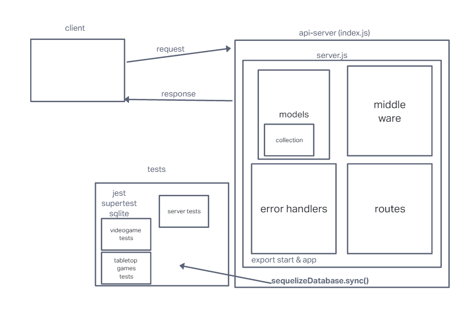
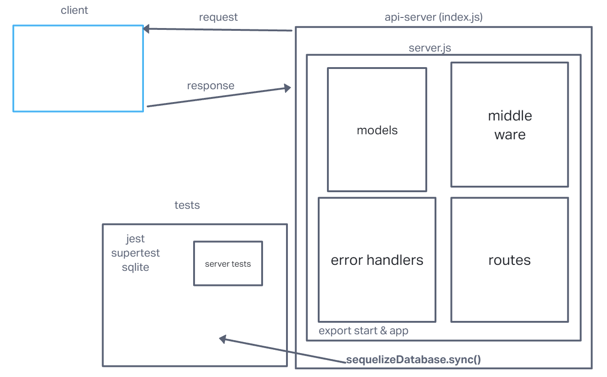

# LAB - 03 / 04

## Project: api-server

### Author: Ike Steoger

### Problem Domain

This is a basic Express server including use of SQL data models using best practices, including server modularization, use of middleware, and tests.

### Links and Resources

- [GitHub Actions ci/cd](https://github.com/IkeSteoger/api-server/actions)
<!-- - [back-end dev server url]() -->
- [back-end prod server url](https://api-server-main.onrender.com)

### Collaborators

Ryan Eastman  
Reece Renniger  
Tony Regalado  
Ryan Gallaway

Code Review with Kenya Womack!  
Key takeaway: So many different ways to code things - always a good idea to checkout how other people are doing the same thing, you might learn something new!  
[My Review of Kenya's Code](https://github.com/KenyaWomack/api-server/pull/5)  
[Kenya's Review of my code](https://github.com/IkeSteoger/api-server/pull/4)

### Setup

#### `.env` requirements (where applicable)

See the `.env.sample`

#### How to initialize/run your application (where applicable)

Clone repo, `npm i`, then run `nodemon` in the terminal

#### Routes

- GET : `/` - server is live route
- GET : `/videogames` - list all video games in DB  
- GET : `/videogames/:id` - list video game by ID  
- POST : `/videogames` - add to video games DB  
- PUT : `/videogames/:id` - updates video game by ID  
- DELETE : `/videogames/:id` - delete video game by ID
- GET : `/tabletopgames` - list all tabletop games in DB  
- GET : `/tabletopgames/:id` - list tabletop game by ID  
- POST : `/tabletopgames` - add to tabletop games DB  
- PUT : `/tabletopgames/:id` - updates tabletop game by ID  
- DELETE : `/tabletopgames/:id` - delete tabletop games by ID

#### Tests

To run tests, after running `npm i`, run the command `npm test`

#### UML

